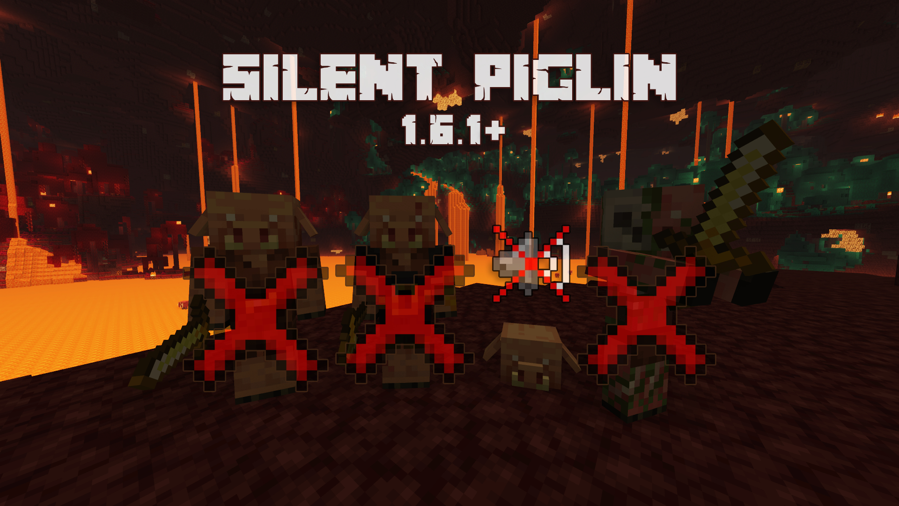

# Silent Piglin
A Minecraft resource pack to remove the Piglin (all types) sounds from 1.6.1+

## Downloads
  

## 1.6.1+ Compatibility

## Compatibility
**Minecraft Java Edition: 1.6.1 - Current Release**

 

 

---
Repository For The Silent Piglin Resource Pack - <b>[Made By CodingCarson](https://www.youtube.com/@CodingCarson)</b>